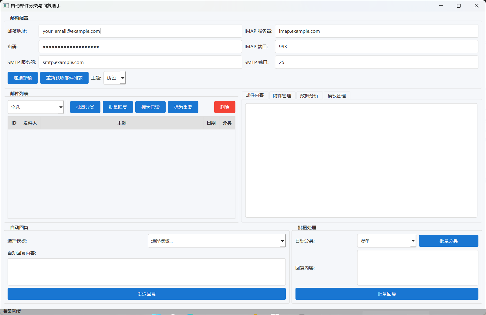
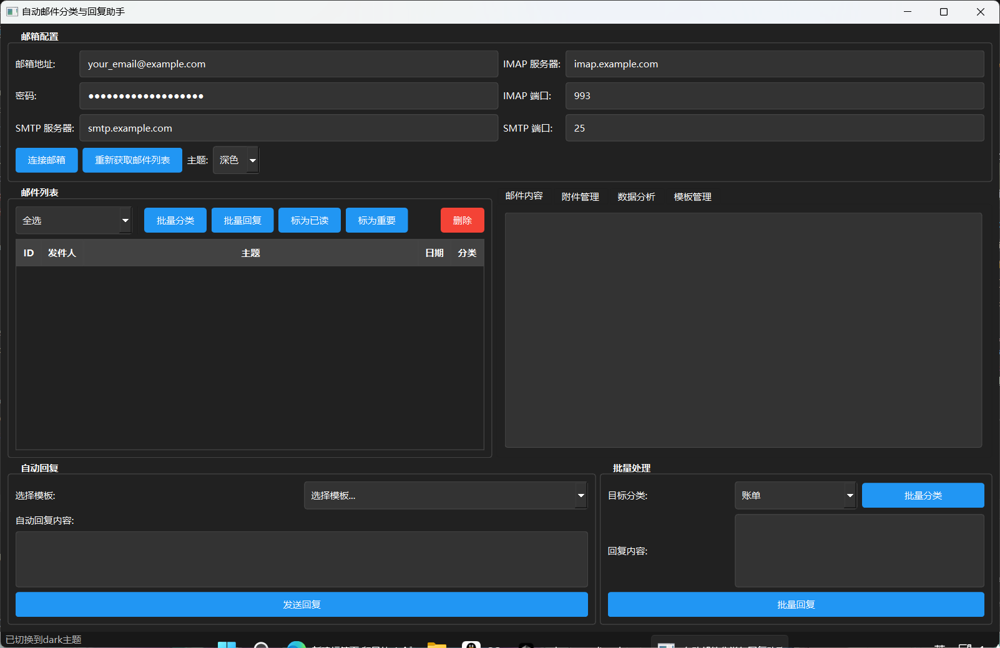

# 自动邮件分类与回复助手


## 简介
自动邮件分类与回复助手是一个Python项目，旨在帮助用户自动对邮件进行分类并生成相应的回复。该项目通过连接到指定的邮箱，获取邮件，对邮件进行分类，并根据邮件的类别生成自动回复。同时，项目还提供了一个基于PyQt6的现代图形用户界面（GUI），方便用户进行操作。



## 功能特点
- **邮件分类**：基于关键词匹配的规则对邮件进行分类，支持多种预设分类。
- **自动回复**：根据邮件的分类生成相应的自动回复内容。
- **批量处理**：支持对多封邮件进行批量分类和回复。
- **现代界面**：提供美观、直观的PyQt6图形用户界面，支持浅色/深色主题切换。
- **快捷键支持**：支持常用操作的快捷键，提高操作效率。
- **附件处理**：支持邮件附件的查看和保存。
- **模板管理**：提供模板管理功能，支持自定义回复模板。
- **异步操作**：支持邮件异步处理，提高操作响应速度。
- **数据分析**：支持对邮件数据进行统计分析。

## 项目结构
```
├── async_operations.py   # 异步操作处理模块
├── attachment_handler.py # 附件处理模块
├── attachments/          # 附件存储目录
├── auto_reply.py         # 自动回复生成模块
├── config.py             # 配置文件，包含邮箱和分类相关配置
├── email_analytics.py    # 邮件数据分析模块
├── email_classifier.py   # 邮件分类模块
├── email_connector.py    # 邮箱连接和邮件获取模块
├── email_data.db         # 邮件数据存储数据库
├── email_sender.py       # 邮件发送模块
├── gui_pyqt6.py          # PyQt6图形用户界面模块
├── icons/                # 应用图标目录
├── image/                # 图片资源目录
├── main.py               # 主程序入口
├── requirements.txt      # 项目依赖库列表
├── template_manager.py   # 模板管理模块
├── templates/            # 模板存储目录
└── README.md             # 项目说明文档
```

## 安装与配置
### 安装依赖
确保你已经安装了Python 3.x，并使用以下命令安装所需的依赖库：
```bash
pip install -r requirements.txt
pip install nltk
```
同时，运行以下Python代码下载NLTK数据：
```python
import nltk
nltk.download('punkt')
nltk.download('stopwords')
```

### 配置邮箱信息
打开 `config.py` 文件，修改以下邮箱配置信息：
```python
# 邮箱配置
EMAIL_ADDRESS = "your_email@example.com"
EMAIL_PASSWORD = "your_email_password"
IMAP_SERVER = "imap.example.com"
IMAP_PORT = 993
SMTP_SERVER = "smtp.example.com"
SMTP_PORT = 25
```

### 配置分类和回复模板
在 `config.py` 文件中，可以修改 `CATEGORY_KEYWORDS` 和 `AUTO_REPLY_TEMPLATES` 来调整邮件分类的关键词和自动回复的模板。

## 使用方法
### 启动程序
运行 `main.py` 文件，程序将启动图形界面：
```bash
python main.py
```

### 图形用户界面
程序启动后，你可以在界面上进行以下操作：
1. **连接邮箱**：输入邮箱地址、密码、IMAP和SMTP服务器信息，点击"连接邮箱"按钮。
2. **获取邮件列表**：点击"重新获取邮件列表"按钮，获取邮箱中的邮件列表。
3. **查看邮件内容**：在邮件列表中选择一封邮件，邮件内容将显示在右侧的文本框中，同时自动生成回复内容。
4. **发送回复**：点击"发送回复"按钮，将自动回复发送给发件人。
5. **批量处理**：在批量处理区域，可以选择目标分类对多封邮件进行批量分类，也可以输入回复内容对多封邮件进行批量回复。
6. **切换主题**：在顶部工具栏选择"浅色"或"深色"主题，立即切换界面风格。



### 快捷键
程序支持以下快捷键操作：
- **Ctrl+R**：回复当前选中的邮件
- **Ctrl+F** 或 **F5**：刷新邮件列表
- **Ctrl+D**：删除选中的邮件
- **Ctrl+M**：将选中的邮件标记为已读
- **Ctrl+N**：撰写新邮件
- **Esc**：清除当前选择

## 注意事项
- 请确保你的邮箱账户已经开启了IMAP和SMTP服务，并且使用的密码是授权码或应用密码。
- 如果在运行过程中遇到连接失败或其他错误，请检查邮箱配置信息和网络连接。

## 贡献
如果你有任何建议或改进意见，欢迎提交Pull Request或提出Issue。